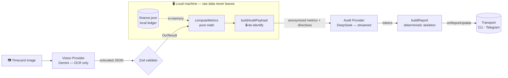

# MoneyGuard

[](https://github.com/liuyuelintop/moneyguard-pipeline/actions/workflows/ci.yml)
[](https://nodejs.org)
[](https://www.typescriptlang.org)
[](LICENSE)

**A privacy-first, vision→reasoning pipeline that turns a photo of a timecard into a warm, numerically-grounded financial audit — without ever sending your raw finances to the cloud.**

Snap a picture of a timecard. MoneyGuard reads the hours with a vision model, computes your real weekly position **locally**, de-identifies it down to abstract metrics, and streams back a mentor-style audit from a text model — token by token, rate-limit-safe.

```bash
# Runs end-to-end with zero API keys (deterministic mock providers):
npx moneyguard --mock fixtures/timecard.png
```

```
📊 Wage Audit (2026-W26)
---
🕒 Labor:   38 hrs
💰 Gross:   $950.00 AUD
📉 Burn:    $552.38 AUD
💎 Surplus: $397.62 AUD | STABLE
---
🧠 Audit:
先停下来给自己一个肯定——一周四十多个小时的体力活扛下来，
还能自费把学习和 AI 工具一个个续上，这份狠劲本身就值钱…
```

---

## Why this exists (the problem)

Someone self-funding a career change into tech needs honest financial feedback, but the input is a **photo** and the data is **deeply personal** — exact hourly rate, rent, every subscription. Two hard requirements fall out immediately:

1. **The raw ledger must never leave the machine.** Not in a prompt, not in a log.
2. **The model must still reason about the *real* numbers.**

MoneyGuard resolves that tension with a **local de-identification boundary**: all sensitive math happens on-device, and only *abstract, aggregated* metrics + *derived* tone directives are sent to the reasoning model.

---

## Architecture at a glance



**Split-brain compute.** Two models, two jobs: a **vision** model does structured OCR (numbers only), a **text** model does the empathetic copywriting. Neither is trusted to do the other's job, and neither sees raw finances.

**The pipeline is the product; transports are disposable.** `runMoneyGuardPipeline(imageBuffer, { onReportUpdate })` is completely channel-agnostic. The CLI and the Telegram adapter are each ~40 lines that own *only* transport concerns.

---

## Engineering challenges worth reading the code for

### 1. A local de-identification boundary (`src/payload.ts`, `src/metrics.ts`)
The ledger is read **in-memory** and reduced to tag-aggregated weekly sums and a health *tier*. The payload sent upstream contains **no** raw amounts, item names, or hourly rate — only numbers like `Weekly gross income: $950.00` and *derived* directives like *"The job market is tough for people breaking into tech…"*. Raw `context` values are translated into instructions, never forwarded. This boundary is locked by a test that seeds sentinel values (`hourlyRate: 99.99`, `rent: 7777.77`) and asserts they never appear in the outbound prompt (`src/pipeline.test.ts`).

### 2. Stream-safe retry — the subtle one (`src/resilience.ts`)
You **cannot** wrap a live token stream in a naive "retry on failure": re-running it replays tokens the user already saw. MoneyGuard uses `streamWithConnectRetry`, which retries **only while the stream fails before its first chunk** (connection establishment). Once a single token is emitted, it never retries. Non-streaming calls (OCR) use ordinary `withRetry` with **exponential backoff + equal jitter**. Two retry strategies, deliberately not interchangeable — enforced by tests.

### 3. Streaming under a 1000ms throttle (transports)
Telegram returns **HTTP 429** if you edit a message too fast. Every transport gates streamed re-renders to **one per 1000ms** while *always* applying the final frame, and keeps a trailing `▌` cursor until the last token lands. Crucially this lives in the **transport**, not the pipeline — the same `THROTTLE_MS = 1000` contract appears in both `src/cli/main.ts` and `examples/telegram/adapter.ts`, proving it's a transport property.

### 4. Untrusted model output is validated, never cast (`src/schemas.ts`)
OCR output is hostile input. It's parsed with Zod: hours are coerced from possible strings, constrained to `(0, 168]`, and a missing confidence defaults to `low` while an *unexpected* confidence is rejected. A blurry photo yields a clean *"Vision Error"*, never a crash.

### 5. Tag-driven config — no hardcoded categories (`src/schemas.ts`, `src/metrics.ts`)
`finance.json` is a list of tagged line items (`essential`, `strategic_weapon`, `discretionary`, …) with a `cadence` (`monthly`/`weekly`). Aggregation filters by `tags.includes(...)` and normalizes every item to weekly. Adding a new category means adding a tag to the Zod enum — **never** a new `if` branch.

### 6. Dependency-injected providers (`src/providers/`)
The pipeline depends on two interfaces — `VisionProvider` and `AuditProvider` — not on any SDK. That yields three implementations behind one seam: **Gemini**, **DeepSeek**, and a deterministic **Mock**. The mock is what lets the whole pipeline run (and be tested) with zero keys and zero network. Tests inject stubs directly — no module mocking required.

### 7. A thin transport + a discriminated result (`src/pipeline.ts`)
The pipeline returns `{ ok: true } | { ok: false, kind: "config" | "vision" | "model", message }`. Transports never inspect internals — they render `message` on failure and stream on success. Local config errors (bad JSON / failed schema) are deliberately distinguished from network/vision errors.

---

## Quickstart

**Requirements:** Node ≥ 22.

```bash
git clone https://github.com/liuyuelintop/moneyguard-pipeline.git && cd moneyguard-pipeline
pnpm install            # or npm install

# 1) Run with zero keys — deterministic mock providers:
pnpm moneyguard --mock fixtures/timecard.png

# 2) Run the test suite (no keys needed):
pnpm test

# 3) Build the distributable library + CLI:
pnpm build
```

### Live mode (real models)

```bash
cp .env.example .env       # then fill in your keys
cp finance.example.json finance.json   # your private ledger (gitignored)

# .env: GEMINI_API_KEY=...  DEEPSEEK_API_KEY=...
pnpm moneyguard path/to/real-timecard.png
```

| Variable | Purpose | Default |
| --- | --- | --- |
| `GEMINI_API_KEY` | Vision / OCR auth | — (required, live) |
| `DEEPSEEK_API_KEY` | Audit / text auth | — (required, live) |
| `MONEY_GUARD_VISION_MODEL` | OCR model | `gemini-2.5-flash` |
| `MONEY_GUARD_TEXT_MODEL` | Audit model | `deepseek-v4-flash` |
| `MONEYGUARD_MOCK` | Force offline providers (`--mock`) | off |
| `MONEY_GUARD_DEBUG` | Enable safe diagnostics without payloads, headers, secrets, or env values | off |

### Private `/extract` HTTP endpoint

The private OCR endpoint is started with:

```bash
pnpm build
node dist/http/server.js
```

Runtime contract:

| Setting | Contract |
| --- | --- |
| `PORT` | HTTP server listens on this value when provided; otherwise falls back to `10000`. |
| Bind host | The HTTP server binds to `0.0.0.0` so Render can route traffic to it. |
| `HOST` | Ignored by the executable HTTP entrypoint. Use code-level `startExtractServer({ host })` only for embedded tests/tools. |
| `MONEYGUARD_PIPELINE_CREDENTIAL` | Required bearer credential for `POST /extract`; keep present and masked in hosting UI. |
| `GEMINI_API_KEY` | Required only for live OCR provider calls; keep present and masked in hosting UI. |
| `MONEYGUARD_MOCK` | Must be `false` or unset for live OCR; set only for deterministic offline tests. |
| `MONEY_GUARD_DEBUG` | Must be `false` or unset in hosted rehearsal/production; debug output is not needed for private OCR smoke checks. |
| `MONEY_GUARD_VISION_MODEL` | Optional OCR model override; defaults to `gemini-2.5-flash`. |
| `NODE_VERSION` | Use Node 22 on hosts that require an explicit runtime version. |
| `finance.json` | Required at process root for hosted totals math; provide it as a host secret file, not a committed file. Unknown string `context.marketCondition` values are normalized to `neutral` with the fixed diagnostic `market_condition_normalized`. |

`POST /extract` accepts `multipart/form-data` with `mode=real-ocr` and an `image` file. Authentication is checked before the request body is read. The image cap is 5 MiB, and the total HTTP request cap is 5 MiB + 256 KiB to allow multipart overhead; requests over the total cap return `413` before multipart parsing.

Accepted image MIME types are `image/png` and `image/jpeg`; `image/jpg` is normalized to canonical `image/jpeg`. `image/webp` is not accepted for the rehearsal contract. The endpoint verifies that the declared MIME type matches a bounded container-structure check before it calls the vision provider, and it passes the validated canonical MIME type to Gemini. The checks require PNG `IDAT` before `IEND` and JPEG segment structure with `EOI`; they are not complete image decoding. Mismatched, malformed, or unsupported image types return `415`.

Successful responses are totals-only:

```json
{
  "source": "real-ocr",
  "extraction": {
    "totalHours": 38,
    "hourlyRate": 25,
    "grossWage": 950,
    "currency": "AUD",
    "confidence": 0.9,
    "warnings": []
  }
}
```

The endpoint must never return raw image bytes, raw OCR text, filenames, MIME metadata, worker/employer metadata, or shift rows.

---

## Using it as a library

```ts
import { runMoneyGuardPipeline, mockProviders } from "moneyguard";

const result = await runMoneyGuardPipeline(imageBuffer, {
  providers: mockProviders(),            // or omit for env-selected live providers
  onReportUpdate: async (text, final) => {
    // YOU own throttling/transport here. final === true is the last frame.
    process.stdout.write(text + "\n");
  },
});

if (!result.ok) console.error(result.kind, result.message);
```

Wiring it to a real Telegram bot is a few lines — see [`examples/telegram/`](examples/telegram/).

---

## Project layout

```
src/
  pipeline.ts        Orchestrator (channel-agnostic, DI providers, discriminated result)
  metrics.ts         Pure finance math — cadence normalization, tag subtotals, tier   🔒
  payload.ts         Local de-identification → anonymized upstream payload            🔒
  resilience.ts      Backoff/jitter retry + stream-safe connect-retry + error mapping 🔒
  schemas.ts         Zod contracts for the ledger and untrusted OCR output
  prompts.ts         Static persona + OCR prompts (dynamic data is built separately)
  report.ts          Deterministic Markdown skeleton (model can't hijack structure)
  config.ts          Single source of truth for env-driven config
  providers/         VisionProvider/AuditProvider interfaces + Gemini, DeepSeek, Mock
  cli/main.ts        CLI transport (owns the 1000ms throttle)
examples/telegram/   The original bot transport this was extracted from
```
🔒 = privacy/resilience redline modules.

## Testing

```bash
pnpm test          # full offline suite: math, retry semantics, privacy boundaries, and pipeline paths
pnpm typecheck     # strict TS, no implicit any, noUncheckedIndexedAccess
```

The suite runs entirely offline via the mock providers and asserts the two hard guarantees directly: **no raw finances cross the boundary**, and **a live stream is never replayed on retry**.

## Contributing

Issues and PRs welcome — see [CONTRIBUTING.md](CONTRIBUTING.md). The three architectural redlines (privacy boundary, stream-safe retry, transport throttle) are intentional; please don't regress them.

## License

MIT © 2026 Yuelin Liu
